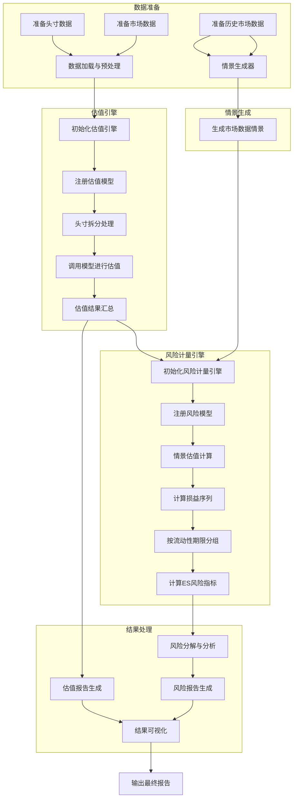

# marketRiskValuation
市场风险及估值计算流程图



# 市场风险及估值计算系统

## 简介

本项目实现了一个完整的市场风险及估值计算系统，基于Python开发，能够处理多种金融工具的估值和风险计量。系统主要包括以下功能：

1. **估值引擎**：计算各类金融工具的公允价值
2. **风险计量引擎**：计算预期尾部损失(ES)等风险指标
3. **BDT模型**：用于可赎回/可回售债券等含权债券的估值
4. **情景生成器**：基于历史数据生成市场数据情景，用于风险计量

## 安装

### 环境要求

- Python 3.8+
- 依赖包：numpy, scipy, pandas, matplotlib, plotly

### 安装步骤

```bash
# 克隆仓库
git clone https://github.com/your-username/market-risk-valuation.git
cd market-risk-valuation

# 安装依赖
pip install -r requirements.txt

# 安装开发模式
pip install -e .
```

## 使用指南

### 基本工作流程

1. **数据准备**：准备头寸数据和市场数据
2. **初始化引擎**：初始化估值引擎和风险计量引擎
3. **模型注册**：向引擎注册相应的估值模型和风险模型
4. **估值计算**：调用估值引擎计算投资组合价值
5. **风险计量**：调用风险计量引擎计算风险指标

### 示例代码

```python
from market_risk_valuation.engine.valuation_engine import ValuationEngine
from market_risk_valuation.engine.risk_engine import RiskEngine
from market_risk_valuation.models.bond_models.callable_bond import CallableBondModel
from market_risk_valuation.models.risk_models.expected_shortfall import ExpectedShortfall
from market_risk_valuation.data.scenario_generator import ScenarioGenerator
import pandas as pd
from datetime import datetime

# 初始化引擎
valuation_engine = ValuationEngine(parallel=True)
valuation_engine.register_model('callable_bond', CallableBondModel)

risk_engine = RiskEngine(valuation_engine, parallel=True)
risk_engine.register_risk_model('ES', ExpectedShortfall)

# 加载数据
positions = pd.read_csv('data/positions.csv')
market_data = load_market_data('data/market_data.json')
historical_data = pd.read_csv('data/historical_data.csv', index_col='date', parse_dates=True)

# 生成情景
scenario_generator = ScenarioGenerator()
scenarios = scenario_generator.generate_scenarios(market_data, historical_data, datetime.now())

# 估值计算
portfolio_value = valuation_engine.value_portfolio(positions, market_data, datetime.now())

# 风险计量
es_results = risk_engine.calculate_expected_shortfall(
    positions, market_data, scenarios, datetime.now(),
    confidence_level=0.99,
    liquidity_horizons=[10, 20, 60, 120, 250]
)

# 显示结果
print(f"投资组合价值: {portfolio_value['pv'].sum()}")
print(f"预期尾部损失(ES): {es_results['total']}")
```

## 核心模块说明

### 估值模型

1. **BDT模型 (BDTModel)**
   - 实现了Black-Derman-Toy模型，用于含权债券估值
   - 构建利率二叉树，计算含权债券的价格

2. **外汇远期模型 (FXForwardModel)**
   - 处理外汇远期合约估值
   - 支持PV拆分和币种转换

### 风险模型

1. **预期尾部损失模型 (ExpectedShortfall)**
   - 实现了ES风险指标计算
   - 支持多流动性期限、多风险因子的ES计算
   - 符合巴塞尔III要求的风险计量方法

### 引擎

1. **估值引擎 (ValuationEngine)**
   - 管理估值模型注册表
   - 处理投资组合估值
   - 支持并行计算

2. **风险计量引擎 (RiskEngine)**
   - 调用估值引擎计算情景估值
   - 处理风险指标计算
   - 支持风险分解和分析

### 数据处理

1. **情景生成器 (ScenarioGenerator)**
   - 基于历史数据生成市场数据情景
   - 支持多种变动计算方法

## 扩展功能

### 添加新的估值模型

1. 创建新的模型类，继承自基础模型类
2. 实现`value`方法和其他必要方法
3. 向估值引擎注册模型

```python
from market_risk_valuation.models.base_model import BaseModel

class NewInstrumentModel(BaseModel):
    def value(self, position, market_data, valuation_date):
        # 实现估值逻辑
        return {'pv': calculated_pv, 'currency': currency, 'details': details}

# 注册模型
valuation_engine.register_model('new_instrument', NewInstrumentModel)
```

### 添加新的风险模型

类似地，可以创建新的风险模型并注册到风险计量引擎中。

## 并行计算

系统默认启用并行计算，可以处理大规模投资组合的估值和风险计量。

- 估值引擎并行处理各头寸的估值
- 风险引擎并行处理各情景的估值

可以通过`max_workers`参数控制并行进程数：

```python
valuation_engine = ValuationEngine(parallel=True, max_workers=8)
risk_engine = RiskEngine(valuation_engine, parallel=True, max_workers=8)
```

## 性能考虑

对于大规模计算场景（如数十万头寸、数百个情景），建议：

1. 使用更高效的数据存储格式（如HDF5、Parquet）
2. 考虑使用Dask进行分布式计算
3. 对估值结果进行缓存，避免重复计算

## 许可证

MIT License

## 联系方式

如有问题或建议，请提交Issue或Pull Request。