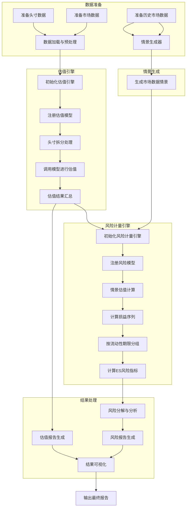

# marketRiskValuation
市场风险及估值计算流程图

```mermaid
flowchart TB
    subgraph 数据准备
        A[准备头寸数据] --> D
        B[准备市场数据] --> D
        C[准备历史市场数据] --> E
        D[数据加载与预处理]
    end
    
    subgraph 估值引擎
        D --> F[初始化估值引擎]
        F --> G[注册估值模型]
        G --> H[头寸拆分处理]
        H --> I[调用模型进行估值]
        I --> J[估值结果汇总]
    end
    
    subgraph 情景生成
        C --> E[情景生成器]
        E --> K[生成市场数据情景]
    end
    
    subgraph 风险计量引擎
        J --> L[初始化风险计量引擎]
        K --> L
        L --> M[注册风险模型]
        M --> N[情景估值计算]
        N --> O[计算损益序列]
        O --> P[按流动性期限分组]
        P --> Q[计算ES风险指标]
    end
    
    subgraph 结果处理
        Q --> R[风险分解与分析]
        J --> S[估值报告生成]
        R --> T[风险报告生成]
        S --> U[结果可视化]
        T --> U
    end
    
    U --> V[输出最终报告]
```

